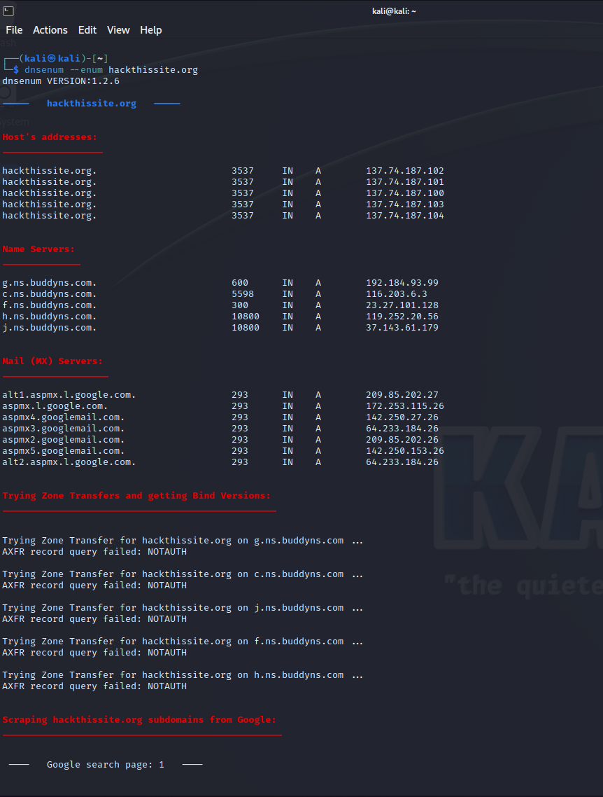
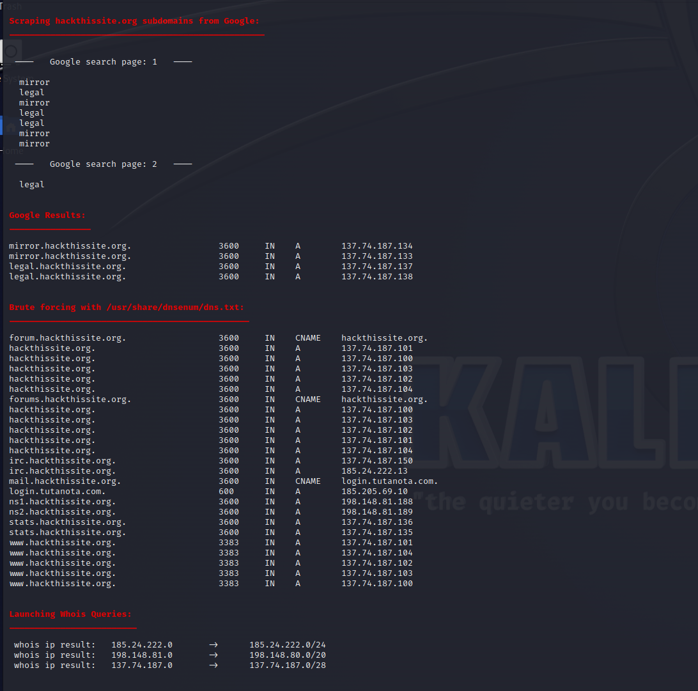

# Orwin Austin [CNS Homework #8/ 16 NOV 2023]

## Research a Security Tool
### The security tool that I chose is DNSenum. It basically enumerates DNS information of a domain to discover non contiguous anonymous blocks. Its operations include:
### 1) Get the host address
### 2) Get the nameservers
### 3) Get the MX record
### 4) Perform axfr queries on nameservers and get BIND VERSION. 
### 5) Get extra names and subdomains via google scraping.
### 6) Brute Force subdomains from file
### 7) Run Whois queries

### This is a multithreaded perl script tool and runs on linux. 
### Apart from that, it is open source and already installed on Kali, fully available on Github https://github.com/SparrowOchon/dnsenum2

## Screenshots
### Below are a few screenshots of the dnsenum being run on a site that was suggested by a tutorial on linuxconfig.org, it was a site that they created specifically for this simulation. 

## References

### https://linuxconfig.org/how-to-use-dnsenum-to-scan-your-server-s-dns-records
###  https://github.com/SparrowOchon/dnsenum2

