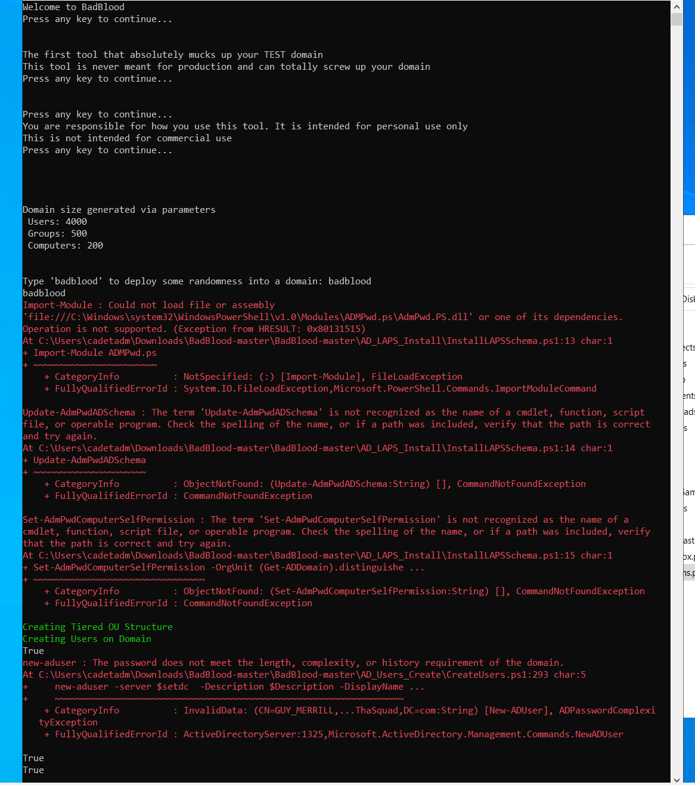

# Orwin Austin [CNS Homework #4/ 28 Sept 2023]

## Part 2
### The following is a screenshot of all of the "Member Of" and "Account" tabs:

## Part 3
### This screenshot shows the logon session of me logged on to the DC. 

## Part 4.1
### This screenshot shows the status of the execution policy that we chose. We chose it because it gave the least errors and most freedom to run different projects. 

## Part 4.2
### This screenshot shows the unique Powershell script I created. Hope you enjoy it!

## Part 4.3
### These screenshots shows the changes made to the AD environment. We created 4000 users, 500 groups and 200 computers. 

